# Calculator-Compose-MultiPlatform

这是一款完全使用 Compose MultiPlatform （Compose-jb）实现的跨平台计算器 APP。

支持移动端（Android、iOS）和桌面端（Windows、macOS、Linux）。

核心代码迁移自：[calculatorCompose](https://github.com/equationl/calculatorCompose) 。

因此核心功能与其保持一致。

## 功能特性

| 是否支持 |               功能               |
|:----:|:------------------------------:|
|  ✔   |         基础四则运算（标准、程序员）         |
|  ✔   |            无限输入（标准）            |
|  ✔   |   % , 1/x , x² , √x 扩展运算（标准）   |
|  ✔   |          运算过程历史记录（标准）          |
|  ✔   | 二进制、八进制、十进制、十六进制随意切换并实时换算（程序员） |
|  ✔   |         位运算：左移、右移（程序员）         |
|  ✔   |    逻辑运算：AND、OR、NOT、XOR（程序员）    |
|  ✔   |         按位显示和输入数值（程序员）         |
|  ✔   |         无限连续计算（标准、程序员）         |
|  ✔   |  切换计算长度，支持64位，32位，16位，8位（程序员）  |
|  ✔   |   支持悬浮窗计算器，可调整位置、大小、透明度（标准）    |
|  ✔   |         符合人体握持习惯的横屏键盘          |
|  ✔   |        旋转手机自动切换标准和程序员键盘        |
|  ✔   |              深色模式              |
|  ✔   |          酷炫的数字动效与振动反馈          |

**注意：**

1. 标准模式使用 BigDecimal 计算，所以理论支持无限位数数字计算（除法和开平方除外，开方使用 16 位精度计算；除法使用 64 位精度计算）
2. 程序员模式因为涉及到二进制计算，故不支持无限位数计算，支持位数可切换为 64位、32位、16位、8位
3. 程序员模式不支持带小数运算，如果运算结果有小数，则会直接抛弃小数部分

## 功能差异部分

所有功能以安卓端为基准，在桌面端和iOS端略有不同，具体不同如下：

### 桌面端

1. 桌面端不支持振动反馈
2. 桌面端历史记录储存于运行内存中，因此关闭程序后历史记录将自动清除
3. 桌面端的悬浮窗功能采用固定窗口为顶部模式实现
4. 桌面端添加对硬件键盘输入的支持

### iOS 端

1. iOS 端暂不支持振动反馈
2. iOS 端暂不支持悬浮窗功能
3. iOS 端暂不支持旋转自动切换键盘

## 截图

Android 端：

|                      浅色                       |                      深色                       |
|:---------------------------------------------:|:---------------------------------------------:|
|  <br /> 标准模式  |  <br /> 标准模式  |
|  <br /> 历史记录  |  <br /> 历史记录  |
|  <br /> 程序员模式 |  <br /> 程序员模式 |
|   <br /> 悬浮窗  |   <br /> 悬浮窗  |

ios 端：

|                   浅色                    |                   深色                    |
|:---------------------------------------:|:---------------------------------------:|
| 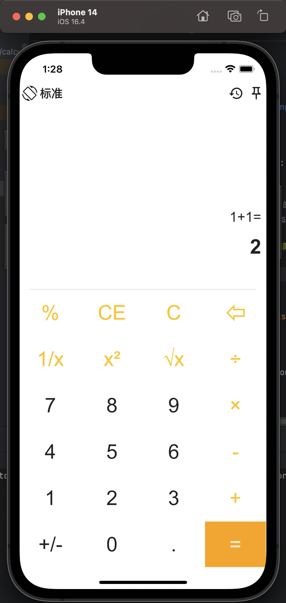 <br /> 标准模式  | 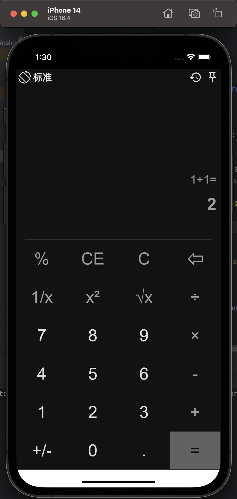 <br /> 标准模式  |
| 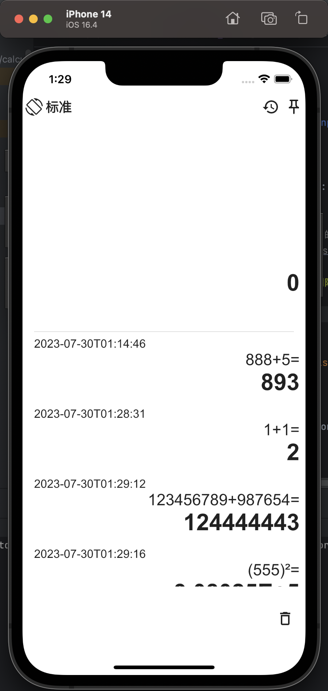 <br /> 历史记录  | 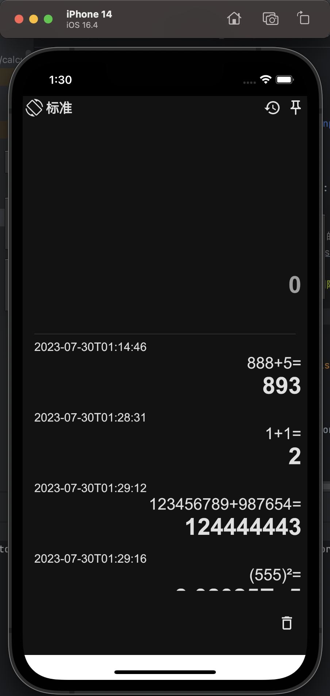 <br /> 历史记录  |
| 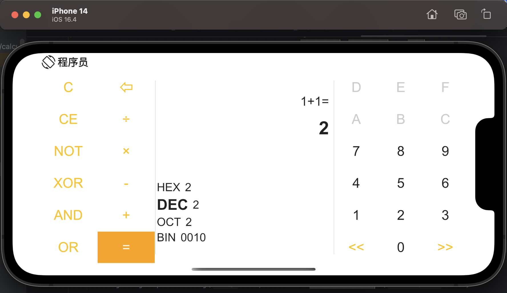 <br /> 程序员模式 | 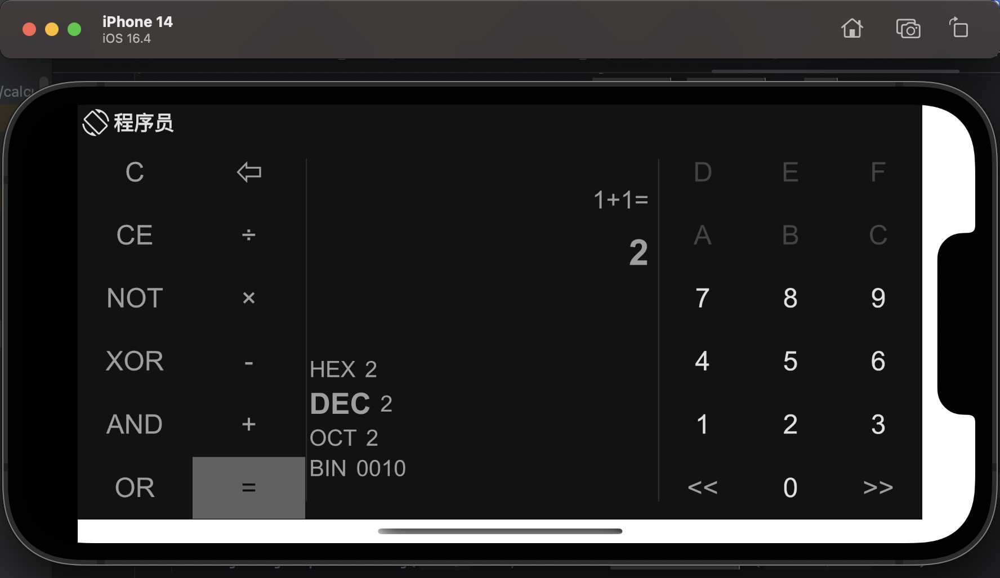 <br /> 程序员模式 |

桌面端：

|               浅色               |               深色               |
|:------------------------------:|:------------------------------:|
| 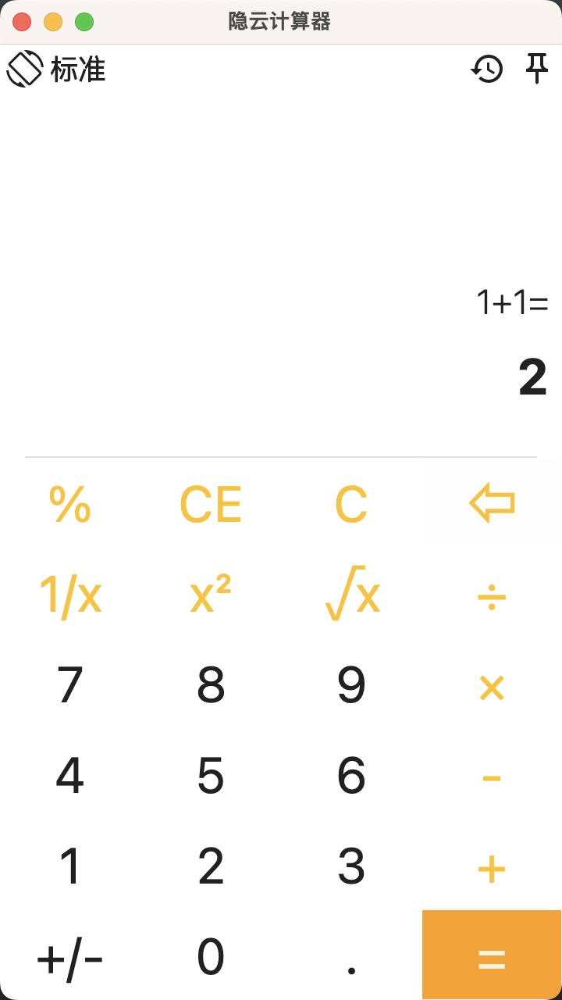 | 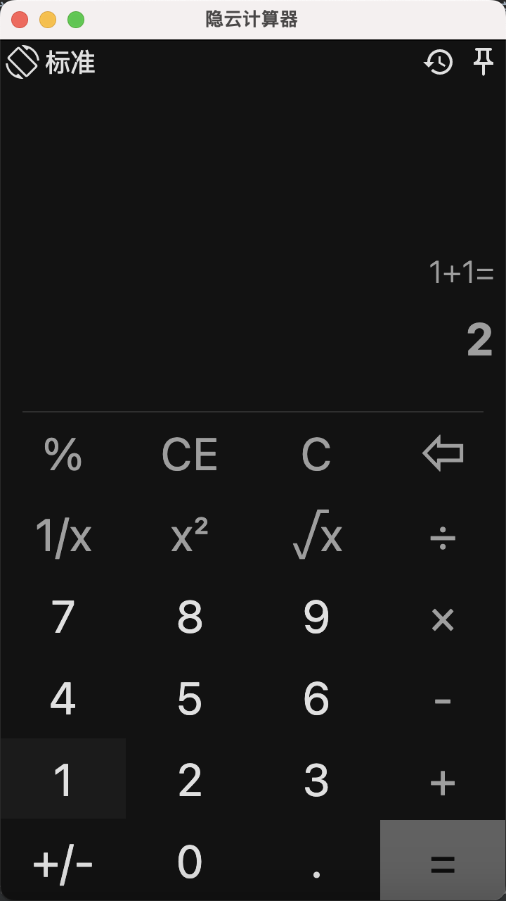 |
| 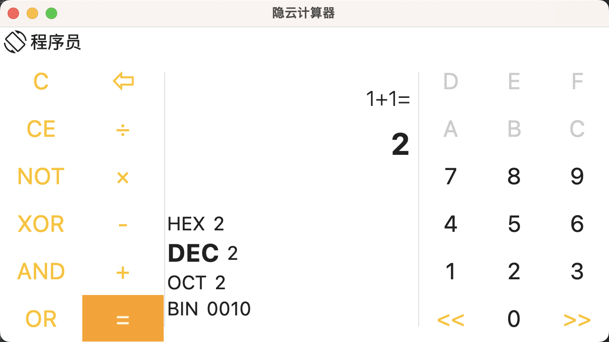 | 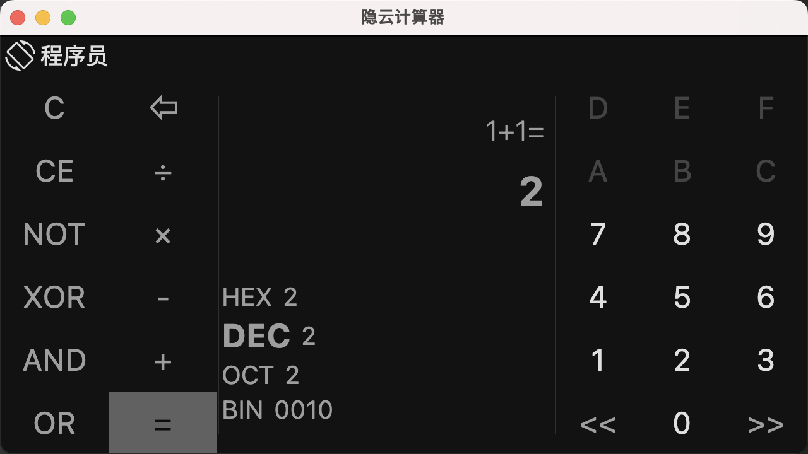 |

其他功能演示（非特定平台）：

1. 按按位显示和输入数值
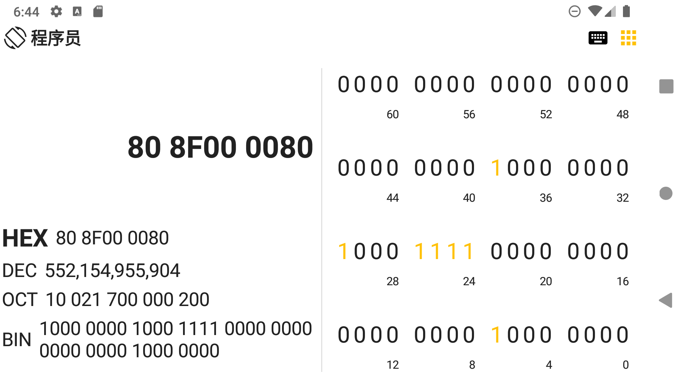


## 如何使用
我在 [releases](https://github.com/equationl/calculator-Compose-MultiPlatform/releases) 提供了安卓 APK 安装包、 macOS 的 ARM 安装包以及 Windows x64 的安装包，可以直接下载使用。

其他平台（macOS x86、Windows、Linux）需要自己 clone 项目后编译。

将项目 clone 到本地后，使用 IDEA 或者 Android Studio 打开项目，等待项目 Sync 完成后。

运行：

```shell
./gradlew run
```

打包：

```shell
./gradlew packageReleaseDistributionForCurrentOS
```

你也可以直接在 IDE 的 Gradle 侧栏中找到以上两个 TASK 直接双击执行：

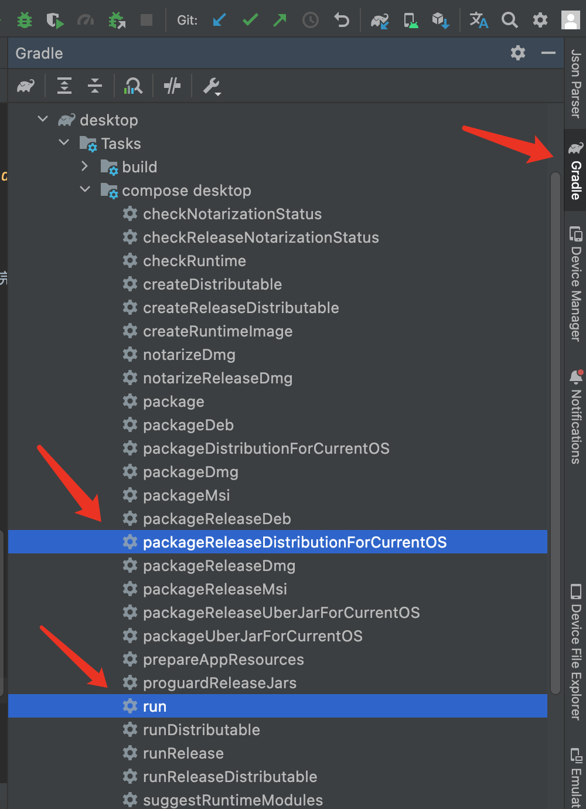

## 其他
处理逻辑参考了 *微软计算器*

布局参考了 *小米计算器* 与 *微软计算器*

实现细节：

1. [使用 Jetpack Compose 实现一个计算器APP](http://www.likehide.com/blogs/android/using_compose_made_a_calculator_app/)
2. [Kotlin & Compose Multiplatform 跨平台（Android端、桌面端）开发实践之使用 SQLDelight 将数据储存至数据库](http://www.likehide.com/blogs/kotlin/using_sqldelight_on_kotlinmultiplatform_with_android_and_desktop/)
3. [Kotlin & Compose Multiplatform 跨平台开发实践之加入 iOS 支持](https://juejin.cn/post/7262707042211856443)
4. [Compose for iOS：kotlin 与 swift 互操作](https://juejin.cn/post/7292354382909620236)
